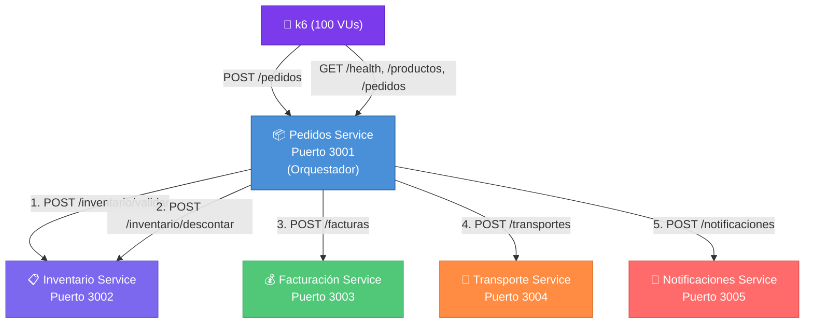

# Reporte de Prueba de Rendimiento — LogiFresh S.A.

**Fecha de ejecución:** 19 de junio de 2026, 08:04 – 08:09 (CST)
**Herramienta:** k6 v0.56.0
**Autor:** Prueba automatizada con análisis de ingeniería de rendimiento

---

## 1. Objetivo de la Prueba

Evaluar el comportamiento del sistema de microservicios de LogiFresh S.A. bajo una **carga de 100 usuarios virtuales concurrentes** durante un período continuo de **5 minutos**, midiendo tiempos de respuesta, throughput, tasas de error y estabilidad general.

---

## 2. Análisis de Arquitectura

### 2.1 Arquitectura del Sistema

LogiFresh S.A. implementa una **arquitectura de microservicios** compuesta por 5 servicios independientes, cada uno ejecutándose como un proceso Node.js + Express en su propio puerto:



### 2.2 Flujo Crítico: POST /pedidos

El endpoint `POST /pedidos` es el **flujo más crítico** del sistema. Una sola petición desencadena una **cadena secuencial de 5 llamadas HTTP internas** entre microservicios:

1. `POST /inventario/validar` → Valida existencia del producto y stock disponible
2. `POST /inventario/descontar` → Descuenta el stock del inventario
3. `POST /facturas` → Genera la factura del pedido
4. `POST /transportes` → Asigna el transporte al pedido
5. `POST /notificaciones` → Envía notificación al cliente

> [!IMPORTANT]
> Cada petición de usuario genera **5 llamadas HTTP inter-servicio adicionales**, por lo que 100 usuarios concurrentes pueden generar hasta **~500 llamadas HTTP internas simultáneas**.

### 2.3 Endpoints Evaluados

| Endpoint | Método | Servicio destino | Tipo de operación |
|---|---|---|---|
| `/pedidos` | POST | Orquesta 4 microservicios | Escritura (flujo completo) |
| `/health` | GET | Pedidos Service (local) | Lectura (health check) |
| `/productos` | GET | Inventario Service (proxy) | Lectura (catálogo) |
| `/pedidos` | GET | Pedidos Service (local) | Lectura (listado) |

---

## 3. Estrategia de Prueba

### 3.1 Tipo de Prueba

Se ejecutó una **prueba de carga (Load Test)**, un subtipo de prueba de rendimiento que evalúa el comportamiento del sistema bajo una demanda sostenida y representativa del uso real.

### 3.2 Diseño de Escenarios

Se diseñaron **2 escenarios concurrentes** para simular un patrón de uso realista:

| Escenario | VUs | Ejecutor | Función | Justificación |
|---|---|---|---|---|
| `crear_pedidos` | 80 | `constant-vus` | `crearPedido()` | Flujo crítico. Representa el 80% de la carga del sistema (operaciones de escritura orquestada) |
| `consultas` | 20 | `constant-vus` | `consultarEndpoints()` | Lecturas concurrentes. Representa el 20% de carga típica (consultas de estado y catálogo) |

**Total: 100 VUs durante 5 minutos (300 segundos)**

### 3.3 Justificación de la Configuración

| Parámetro | Valor | Justificación |
|---|---|---|
| **VUs totales** | 100 | Nivel de carga especificado para evaluar concurrencia significativa |
| **Distribución 80/20** | 80 POST + 20 GET | Refleja un sistema donde la mayoría de operaciones son transaccionales |
| **Duración** | 5 minutos | Período suficiente para alcanzar estado estable y detectar degradación progresiva |
| **Executor** | `constant-vus` | Mantiene carga constante para medir el rendimiento bajo demanda sostenida |
| **Sleep aleatorio** | 100ms–600ms (POST), 500ms–1.5s (GET) | Simula think-time de usuarios reales, evitando carga artificialmente agresiva |
| **Producto P001** | Stock 100,000 | Evita agotar inventario durante la prueba, manteniendo flujos exitosos |
| **Cantidad 1** | Fija por pedido | Minimiza variabilidad para aislar el rendimiento del sistema |

### 3.4 Criterios de Aceptación (Thresholds)

| Métrica | Umbral | Propósito |
|---|---|---|
| `http_req_failed` | `rate < 0.05` (5%) | Menos del 5% de solicitudes con error |
| `http_req_duration avg` | `< 8000ms` | Tiempo promedio aceptable |
| `http_req_duration p(95)` | `< 15000ms` | 95% de solicitudes por debajo de 15s |
| `pedido_duration avg` | `< 10000ms` | POST /pedidos promedio menor a 10s |
| `pedido_success_rate` | `rate > 0.95` (95%) | Al menos 95% de pedidos exitosos |

---

## 4. Resultados de la Prueba

### 4.1 Tabla Resumen de Métricas Generales

| Métrica | Resultado | Interpretación |
|---|---|---|
| **Tiempo promedio** | **32.58 ms** | ✅ Excelente. Muy por debajo del umbral de 8,000 ms |
| **Tiempo mínimo** | **0.09 ms** | Respuestas locales extremadamente rápidas (health checks) |
| **Mediana (p50)** | **11.22 ms** | El 50% de las solicitudes se resolvió en menos de 12 ms |
| **Tiempo máximo** | **554.48 ms** | ✅ Aceptable. El peor caso fue ~0.5s, sin outliers extremos |
| **Percentil 90 (p90)** | **87.55 ms** | El 90% de solicitudes respondió en menos de 88 ms |
| **Percentil 95 (p95)** | **139.89 ms** | ✅ Excelente. Muy por debajo del umbral de 15,000 ms |
| **Tasa de errores** | **0.00% (0 errores)** | ✅ Perfecto. Cero solicitudes fallidas |
| **Throughput** | **237.21 req/s** | El sistema procesó ~237 solicitudes por segundo |
| **Total de solicitudes** | **71,162** | Solicitudes HTTP completadas en 5 minutos |
| **Checks exitosos** | **100.00%** | Todas las validaciones funcionales fueron aprobadas |

### 4.2 Métricas por Escenario

#### Escenario 1: POST /pedidos (Flujo Crítico — 80 VUs)

| Métrica | Resultado |
|---|---|
| Promedio | **33.43 ms** |
| Máximo | **554.48 ms** |
| Percentil 90 | **89.91 ms** |
| Percentil 95 | **146.31 ms** |
| Iteraciones completadas | **62,504** |
| Errores | **0 (0%)** |

> [!NOTE]
> Cada iteración de POST /pedidos genera internamente 5 llamadas HTTP a otros microservicios. Con 62,504 pedidos exitosos, se ejecutaron aproximadamente **312,520 llamadas HTTP inter-servicio** exitosas.

#### Escenario 2: Consultas GET (Lectura — 20 VUs)

| Endpoint | Promedio | p95 | Máximo |
|---|---|---|---|
| `GET /health` | **12.45 ms** | **67.01 ms** | **254.39 ms** |
| `GET /productos` | **18.05 ms** | **91.87 ms** | **343.05 ms** |
| `GET /pedidos` | **48.78 ms** | **131.40 ms** | **321.62 ms** |
| Iteraciones totales | **2,886** | — | — |

> [!TIP]
> `GET /pedidos` es más lento que los otros GET porque la lista de pedidos crece continuamente durante la prueba (hasta ~62,504 registros en memoria), aumentando el tamaño del payload JSON que debe serializar.

### 4.3 Resultados de Thresholds

| Threshold | Umbral | Resultado real | Estado |
|---|---|---|---|
| `http_req_failed rate < 5%` | < 5% | **0.00%** | ✅ APROBADO |
| `http_req_duration avg < 8000ms` | < 8,000 ms | **32.58 ms** | ✅ APROBADO |
| `http_req_duration p(95) < 15000ms` | < 15,000 ms | **139.89 ms** | ✅ APROBADO |
| `pedido_duration avg < 10000ms` | < 10,000 ms | **33.43 ms** | ✅ APROBADO |
| `pedido_success_rate > 95%` | > 95% | **100.00%** | ✅ APROBADO |

> **Todos los criterios de aceptación fueron APROBADOS.**

---

## 5. Análisis e Interpretación

### 5.1 Evaluación General

El sistema **soporta correctamente la carga de 100 usuarios concurrentes durante 5 minutos** sin degradación significativa. Los indicadores clave son:

- **Cero errores** en 71,162 solicitudes → estabilidad absoluta bajo esta carga
- **Tiempo promedio de 32.58 ms** → rendimiento excelente para una arquitectura con 5 llamadas inter-servicio por transacción
- **p95 de 139.89 ms** → distribución de latencias consistente sin outliers extremos
- **237 req/s de throughput** → capacidad de procesamiento saludable

### 5.2 Análisis de Latencias

```
Distribución de tiempos de respuesta (todos los endpoints):

  0 ms ──────────────────────── 0.09 ms   (mínimo)
       ████████                 11.22 ms  (mediana / p50)
       ████████████████         32.58 ms  (promedio)
       ████████████████████████ 87.55 ms  (p90)
       ██████████████████████████████ 139.89 ms (p95)
       ██████████████████████████████████████ 554.48 ms (máximo)
```

- La **mediana (11.22 ms)** es significativamente menor al promedio (32.58 ms), lo que indica que la mayoría de las solicitudes son rápidas, pero existen peticiones que elevan el promedio (típicamente los POST /pedidos que orquestan 5 servicios).
- La diferencia entre **p90 (87.55 ms)** y **p95 (139.89 ms)** es moderada, indicando que no hay un "cliff" dramático de latencia en los percentiles altos.

### 5.3 Posibles Cuellos de Botella Identificados

| # | Cuello de botella | Evidencia | Severidad |
|---|---|---|---|
| 1 | **Cadena secuencial de llamadas HTTP** | POST /pedidos ejecuta 5 llamadas HTTP en serie. Si un servicio se lentifica, impacta todo el flujo. | ⚠️ Media |
| 2 | **GET /pedidos con crecimiento de datos** | Promedio de 48.78 ms vs 12.45 ms de /health. La lista de pedidos crece en memoria y la serialización JSON se vuelve más costosa. | ⚠️ Media |
| 3 | **Almacenamiento en memoria (arrays)** | Todos los servicios almacenan datos en arrays JavaScript en memoria. Bajo carga prolongada, el consumo de memoria crece linealmente. | ⚠️ Media |
| 4 | **Single-threaded Node.js** | Cada servicio corre en un solo hilo. Bajo cargas mayores, el event loop podría saturarse. | 🔵 Baja (no observada aún) |

### 5.4 Fortalezas del Sistema

- **Estabilidad excepcional**: 0% de errores en toda la prueba
- **Latencias bajas**: Incluso el peor caso (554 ms) es muy aceptable
- **Idempotencia**: El sistema de facturación maneja correctamente duplicados
- **Escalabilidad horizontal potencial**: La arquitectura de microservicios permite escalar servicios individuales

---

## 6. Recomendaciones de Optimización

### Para soportar mayor carga (500–1000+ VUs):

| # | Recomendación | Impacto esperado |
|---|---|---|
| 1 | **Paralelizar llamadas inter-servicio** con `Promise.all()` donde sea posible (facturación + transporte + notificación pueden ejecutarse en paralelo) | Reducción de ~40-60% en latencia de POST /pedidos |
| 2 | **Implementar paginación** en GET /pedidos y otros listados | Elimina degradación progresiva por crecimiento de datos |
| 3 | **Usar base de datos persistente** (PostgreSQL, MongoDB) en lugar de arrays en memoria | Consultas eficientes, persistencia, menor consumo de memoria |
| 4 | **Clustering Node.js** con `cluster` module o PM2 | Aprovecha múltiples cores del CPU, multiplica capacidad |
| 5 | **Agregar caching** (Redis) para lecturas frecuentes (/productos, /health) | Reduce latencia de endpoints GET a < 1ms |
| 6 | **Implementar circuit breaker** para llamadas inter-servicio | Mejora resiliencia ante fallos parciales |
| 7 | **Comunicación asíncrona** (RabbitMQ/Kafka) para notificaciones y transporte | Desacopla servicios no críticos del flujo principal |

---

## 7. Conclusión Técnica

> [!IMPORTANT]
> **El sistema LogiFresh S.A. CUMPLE satisfactoriamente con el escenario de carga evaluado de 100 usuarios concurrentes durante 5 minutos.**

Los resultados demuestran que la arquitectura de microservicios responde con **tiempos de respuesta excelentes** (promedio 32.58 ms), **cero errores**, y un **throughput de 237 solicitudes por segundo**. Todos los umbrales de aceptación definidos fueron superados ampliamente.

El sistema procesó exitosamente **62,504 pedidos completos** (cada uno orquestando 5 microservicios) y **8,658 consultas GET** sin ninguna degradación observable.

Para escalar a cargas superiores (500+ usuarios), se recomienda priorizar la **paralelización de llamadas inter-servicio** y la **implementación de paginación**, ya que son las optimizaciones de mayor impacto con menor esfuerzo de implementación.

---

## Anexo: Configuración Técnica

### Archivo de prueba: [k6_test.js](file:///home/george/George/I_programmer/University/4_year/1_semester/distributed_systems/labs/9_pruebas/logifresh-lab9-microservicios/k6_test.js)

### Resultados JSON: [k6_results.json](file:///home/george/George/I_programmer/University/4_year/1_semester/distributed_systems/labs/9_pruebas/logifresh-lab9-microservicios/k6_results.json)

### Entorno de ejecución:

| Componente | Detalle |
|---|---|
| Sistema operativo | Linux |
| Runtime | Node.js |
| Framework | Express 4.18.2 |
| Herramienta de carga | k6 v0.56.0 |
| Protocolo | HTTP/1.1 (localhost) |
| Base de datos | Ninguna (datos en memoria) |

### Cómo reproducir la prueba:

```bash
# 1. Instalar dependencias
npm install

# 2. Levantar los 5 microservicios (cada uno en su propia terminal)
npm run start:inventario     # Terminal 1
npm run start:facturacion    # Terminal 2
npm run start:transporte     # Terminal 3
npm run start:notificaciones # Terminal 4
npm run start:pedidos        # Terminal 5

# 3. Ejecutar la prueba de carga (Terminal 6)
k6 run k6_test.js
```
